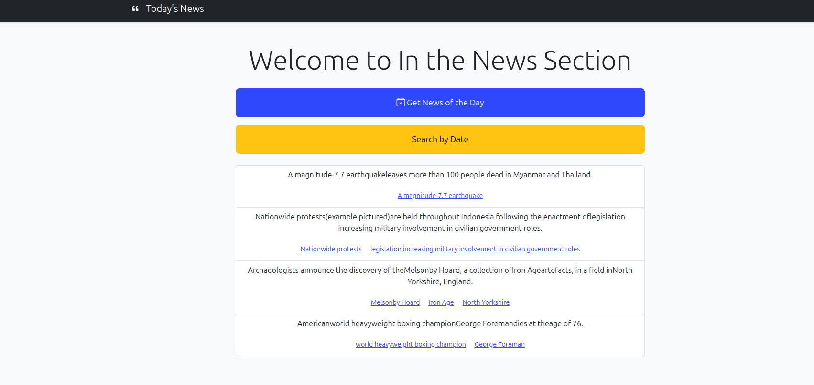

# Access In the News

## Project Overview
This is a web application that displays daily news and allows users to search for news by specific dates. The application fetches news data from a backend API, stores it in a database, and renders it dynamically on the frontend. The project is built using FastAPI for the backend, SQLAlchemy for database management, and a simple HTML/CSS/JavaScript frontend with Bootstrap for styling.

## Features
### Get News of the Day:
- Fetches and displays the latest news for the current day.
- News items include text and relevant links to Wikipedia articles.

### Search News by Date:
- Allows users to search for news items by selecting a specific date.
- Displays all news items for the selected date.

### Dynamic Frontend:
- News items are displayed dynamically using JavaScript.
- Links are clickable and redirect to Wikipedia pages.

### Backend API:
- Provides endpoints to fetch news of the day and search news by date.
- Uses FastAPI for efficient and scalable API development.

### Database Integration:
- Stores news items in a database using SQLAlchemy.
- Ensures data persistence and efficient querying.

## Installation
### Prerequisites
- Python 3.10 or higher
- Node.js (optional, for frontend development)
- MySQL or SQLite (for database)

### Steps
1. **Clone the Repository:**
   ```sh
    git clone <link of this repo>
    cd <dir>
   ```

2. **Set Up a Virtual Environment:**
   ```sh
   python -m venv venv
   source venv/bin/activate  # On Windows, use `venv\Scripts\activate`
   ```

3. **Install Dependencies:**
   ```sh
   pip install -r requirements.txt
   ```

4. **Set Up the Database:**
   - Configure the database connection in `app/database/database.py`.
   - Run the following command to create the database tables:
     ```sh
     python -m app.database.models
     ```

5. **Run the Application:**
   ```sh
   uvicorn main:app --reload
   ```

6. **Access the Application:**
   - Open your browser and navigate to [http://127.0.0.1:8000](http://127.0.0.1:8000)


## API Endpoints
### 1. Get News of the Day
- **Endpoint:** `/api/news_of_the_day`
- **Method:** `GET`
- **Response:** JSON object containing the latest news items.
```[
    {
        "id": "9111b85a3070e79921e923e432867b3f",
        "text": "A magnitude-7.7 earthquake leaves more than 100 people dead...",
        "links": [
            {"url": "/wiki/2025_Myanmar_earthquake", "text": "A magnitude-7.7 earthquake"}
        ],
        "featured_date": "2025-03-28"
    }
]
```

### 2. Search News by Date
- **Endpoint:** `/api/news/{date}`
- **Method:** `GET`
- **Path Parameter:** `date` (in `YYYY-MM-DD` format)
- **Response:** JSON object containing news items for the given date.

```[
    {
        "id": "cd42162d4aa7479f3d48dd9157bbdae7",
        "text": "Nationwide protests are held throughout Indonesia...",
        "links": [
            {"url": "/wiki/2025_Indonesian_protests", "text": "Nationwide protests"}
        ],
        "featured_date": "2025-03-28"
    }
]
```

## Frontend
### Key Files
- **index.html:**
  - Contains the structure of the webpage.
  - Includes buttons for fetching news of the day and searching by date.
- **script.js:**
  - Handles API calls and dynamically updates the DOM with news items.
  - Functions:
    - `getNewsOfTheDay()`: Fetches and displays news of the day.
    - `getNewsByDate(date)`: Fetches and displays news for a specific date.
    - `toggleDateSearchForm()`: Toggles the visibility of the date search form.
- **styles.css:**
  - Custom styles for the webpage.

## Database
### Schema
The database contains a single table, `news`, with the following fields:

| id (Primary Key) | text | links | featured_date |
|------------------|------|-------|--------------|
| 9111b85a3070e79921e923e432867b3f | A magnitude-7.7 earthquake leaves more than 100 people dead... | `[{"url": "/wiki/2025_Myanmar_earthquake", "text": "A magnitude-7.7 earthquake"}]` | 2025-03-28 |
| cd42162d4aa7479f3d48dd9157bbdae7 | Nationwide protests are held throughout Indonesia... | `[{"url": "/wiki/2025_Indonesian_protests", "text": "Nationwide protests"}]` | 2025-03-28 |

## Demo



## Contributing
1. **Fork the repository.**
2. **Create a new branch:**
   ```sh
   git checkout -b feature-branch
   ```
3. **Commit your changes:**
   ```sh
   git commit -m "Added new feature"
   ```
4. **Push to the branch:**
   ```sh
   git push origin feature-branch
   ```
5. **Open a pull request.**


## Acknowledgments
- **FastAPI**: For the backend framework.
- **SQLAlchemy**: For database management.
- **Bootstrap**: For frontend styling.
- **Wikipedia**: For providing the news data.

